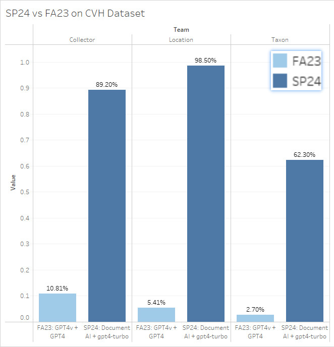

# ML-Herbarium Spring 2024 Summary Report

## 1. Overview

The Spring 2024 Team continues the machine-learning based approach to digitalize and mobilize Asian herbarium collections, our work is guided by our clients Professor Charles Davis, professor Thomas Gardos and Solution Engineer Michelle Voong (via NSF Grant [with Prof. Charles Davis](https://oeb.harvard.edu/news/herbaria-awarded-47-million-mobilize-digital-collections-asian-plant-biodiversity) and [with BU Spark!](https://oeb.harvard.edu/news/herbaria-awarded-47-million-mobilize-digital-collections-asian-plant-biodiversity)). 

We built a pipeline with commercial OCR + LLM, achieving formidable accuracy result with over **62.3%** on Taxon names, **98.5%** on Collection Locations (Province/Country), **89.2%** on Collector, and **80.4%** on Collection Date and opened doors for potential collaborations with Chinese Virtual Herbarium (CVH).

## 2. Achievements

### 2.1 Pipeline and Performance

We have built a Highly accurate pipeline with sufficient benchmark testing on **1000 samples** scraped and randomly selected from the 15,000 samples we collected from [CVH dataset](https://www.cvh.ac.cn/index.php). The performance result below leveraged Document AI and GPT-4-Turbo.

* Highly accurate
	* Taxon name: 62.3%
	* Collection locations (Province/Country): 98.5%
	* Collector name: 89.2%
	* Collection Date: 80.4%
* Cost effective:
	* 351 Min. / 1000 Samples
	* $ 66.5 / 1000 Samples 

The accuracy metrics are calculated this way:

* Taxon Accuracy metrics definition: Exact matching after both groundtruth and extraction of Taxon name are preprocessed, mainly getting rid of scholar name
Taxon name preprocessing example:  (e.g. Lysimachia fortunei Maxim. --> Lysimachia fortunei)
* Taxon Accuracy metrics explanation: There is even discrepancies between groundtruth (scraped from website) and groundtruth.
* Location Accuracy metrics definition: Exact matching of Province / Municiple name. (Required by Charles). Groundtruth also holds similar geographical granularity, so the metrics finer granularity (e.g. city, village, road)
* Collector Accuracy metrics definition: Exact matching of collectors. Groundtruth often hides second authors (et.al.)
* Collection Date Accuracy metrics definition: Exact matching of YYYYMMDD timestamp.

Demo could be found at: [https://huggingface.co/spaces/spark-ds549/TrOCR](https://huggingface.co/spaces/spark-ds549/TrOCR)

### 2.2 Benchmark

On accuracy side, while last semesters' works mainly focuses on 

* **Approach 1**: open-source models (DETR, CRAFT, TrOCR, TaxoNERD) with GBIF datasets (SU23 and prior) and 
* **Approach 2** Commercial OCR/ ViT + LLM (FA23),

but both have shown significant drawbacks. Approach 1's CV models were not fine-tuned for botanics tasks and the first step (DETR) has pruned 30% of the labeled 1,000 samples creating significant drawback on downstream tasks, while TaxoNERD (a NER model for herberia) also only performs on English texts. Approach 2 have seen significant low accuracies on Chinese and Cyrillic texts.

On cost and time, our benchmark results:

* 351 Min. / 1000 Samples
* $ 66.5 / 1000 Samples 

The time performance was calculated under one linear thread for Document AI and GPT-4-Turbo (Input $10.00 / 1M tokens, Output $30.00 / 1M token), while one manual labeler takes around 8 ~ 16 hours and roughly $50 ~ $150 from an outsourcing service provider ([source1](https://mark.hk.cn/pricing/#), [source2](https://ai.baidu.com/support/news?action=detail&id=3192), [source3](https://scale.com/docs/rapid-faq)), while not guarantee the accuracies. 

Furthermore, if future team seek to recreate Approach 1, please refer to Refer to README.md under /trocr for detailed instructions. If problem arise (likely), please refer to the github issue or the huggingface discussions section[https://huggingface.co/spark-ds549/detr-label-detection/discussions/3].

Benchmark pipeline: /ml-herbarium/Spring2024/benchmark_spring2024.ipynb

### 2.3 CVH Scraper 

During our quest for training and validation datasets, we located Chinese Virtual Herbarium's dataset, the largest herbarium in China, collected around 10 million samples with 2.8 million samples hand-labeled by identifier over 20 years. A typical example they host often contains:

1. High resolution of the image.
	* Image of dry plant collection
	* Label created by collector documenting:
		* Taxon name
		* Collector
		* Collection date
		* Collection locality
		* Habitat
	* Label created by identifier documenting:
		* Identified taxon name
		* Identifier name
		* Identified date
2. CVH's digitalized documentations, containing:
	* Taxonomy
	* Taxon name
	* Scientific Name
	* Chinese Name
	* Identified By
	* Identification Date
	* Collector
	* Collector's No.
	* Collection Date
	* Locality
	* Elevation
	* Habitat
	* Life Form	
	* Reproductive Condition

It is worth noting that most modern samples contain printed Chinese and English labels created by both identifier and collector, with high contrast white background and black font.

Example 1: Anaphalis margaritacea (L.) Benth. & Hook. f.
<a href="https://www.cvh.ac.cn/spms/detail.php?id=e6e73365">https://www.cvh.ac.cn/spms/detail.php?id=e6e73365</a>

However, for older samples, it may contain handwritten Chinese and English labels with a darker, harder to identify background by collector, while also likely containing a printed label by identifier. Thus when performing OCR precision, it is extremely important to identify which label (older handwritten label by collector or newer printed label by identifier) we are extracting from.

Example 1: Symplocos Jacq.
<a href="https://www.cvh.ac.cn/spms/detail.php?id=e82ce487">https://www.cvh.ac.cn/spms/detail.php?id=e82ce487</a>

The webpage has a dynamic layout with php thus a selenium automation script was produced to scrape the results. 

Please refer to ml-herbarium/Spring2024/scraper/README_scraper.md for instructions.

### 2.4 Collaboration with Chinese Virtual Herbarium.
I (Handi Xie, @palmpalm7) have successfully established communication with CVH and CVH hope to collaborate with BU Spark! and our work are mutually beneficial.
Detailed transactions could be found at [DS 549 - SP24 - Harvard Herberia - Communication with CVH](https://docs.google.com/document/d/1V_uP6HtzuC6917mslPUZzEJtAX-lI_cGUjk92zC6l0k/edit).

Summary of the communication:

1. CVH is willing to provide us the necessary datasets in exchange of authorships in the final academic output
2. CVH could provide expert labelers but these resources are demanding.
3. Edgecases CVH have discovered:
	* Localities are prone to many errors due to 
		* Transcriber's manual errors (Same tone, different word in Chinese results in vast differences)
		* Vague Description (300 meters from village A, turn right to road B for 50 meters, collections were found under bridge)
4. Detailed collaboration methods are awaiting to be discussed.

Note: CVH's 8 million datasets could be highly beneficial for a multimodal model with a herberia domain focus.

## 3. Words to future team
All the past developers are more than happy to guide and discuss the future of this amazing project! You could reach out to us at:

* (SP24) Andy Xie handi.xie.beintouch@gmail.com
* (SP24) George Trammell gtram@bu.edu
* (SP24) Max Karambelas mkaramb@bu.edu
* (FA23) Smriti Suresh smritis@bu.edu
* (SP23 and SU23) Kabilan Mohanraj kabilanm@bu.edu
